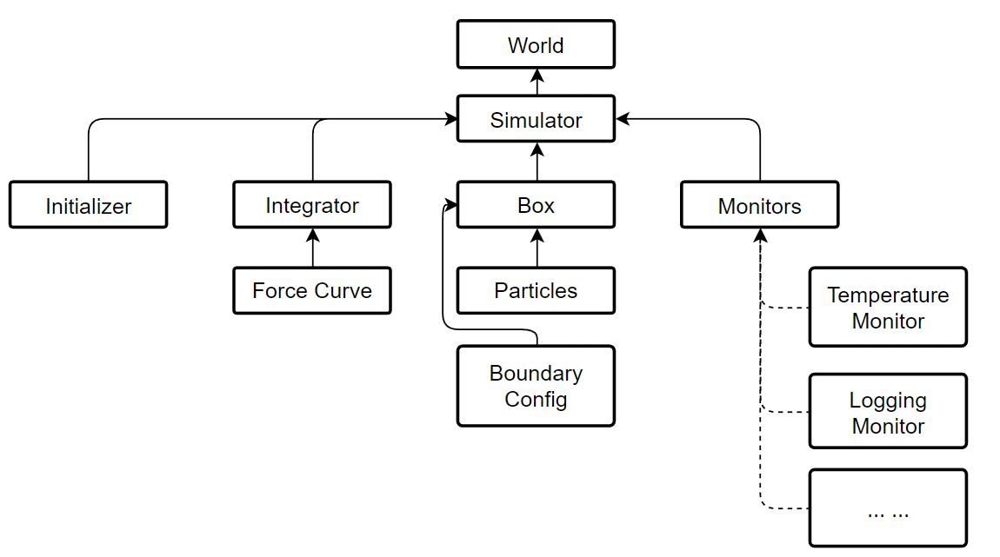
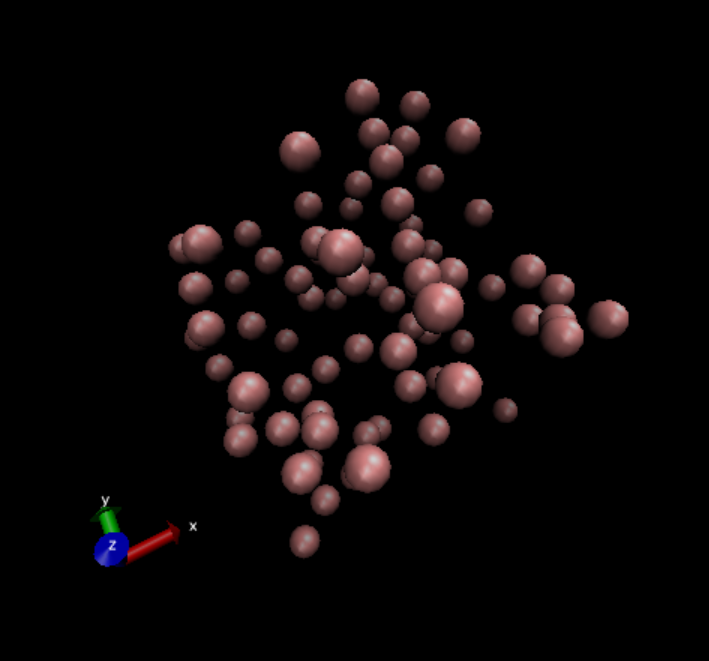
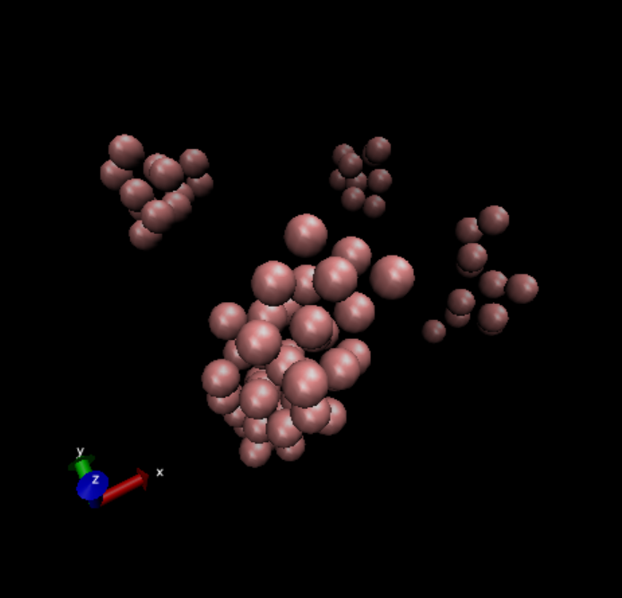

## Homemade Molecular Dynamics Engine

### Introduction

The basic concept here is to setup a framework of classic molecular dynamics(MD) calculation process. Although a very simple version of MD code snippet is even less than 200 lines, this kind of codes can only produce a particular kind of simulation and these codes are not  scalable. 

Here, I want to demonstrate a method that builds a framework that works well with many kinds of force curve and particle velocity update methods.

### Setup

Decouple the different modules used in a MD calculation by defining interfaces and abstract classes. 

As shown below, everything starts from a unique object *world*, and it's actually a container for those who can *tick* as time goes by. Once an object was add into the world, this object can update its state because the world will *tick* in a main loop.

Always, we put a simulator into the world, and thus we can see the evolution of the states in the simulator. A typical simulator contains four part below:

- Box. A box is a container that holds some particles and has a certain boundary configuration. This box only deals with spatial relationship of the particles, e.g., calculate the relative vector between two particles, and do not update the speed and the location of the particle.
- Integrator. An integrator is an updater that updates the velocity and the position of particles. An intergator should have a force curve and a integrate method to do this.
- Monitors. Monitors is a list that holds some monitor. Monitor is something like a probe that can monitor, record, and adjust particle speed and position at runtime.
- Initializer. An initializer initializes the position and velocity of the particles before running.



### Solution

All MD codes are written in `C#`, for balancing development-time efficiency with run-time efficiency.

#### Definition of the Simulator

The following code could show a basic loop of the simulation process. During a single loop (refers to function `Tick()`), the simulator uses the integrator to update the position and the velocity of the particles in the box, and then uses the monitors to record the state or rescale the speed. Finally, the box should invoke method `Wrap()`, to use the boundary conditions to redirect those particles who runs out of the range of the box.

```C#
public class Simulator : ITickable
    {
        public Box? Box { get; set; }
        public Initializer? Initializer { get; set; }
        public Integrator? Integrator { get; set; }
        public List<IMonitor> Monitors { get; set; } = new List<IMonitor>();

        public float TickScale { get; set; }
        public long TickCount { get; set; } = 0;

        public void Initialize() => Initializer?.Initialize(Box!);

        public void Tick()
        {
            foreach (var particle in Box!.Particles!) 
                Integrator?.Integrate(particle, TickScale);
            foreach (var monitor in Monitors) 
                monitor.Rescale(this, TickCount);
            Box.Wrap();
            TickCount++;
        }
    }
```

#### Definition of the Monitor

All monitors can be simply realized by implementing the following interface:

```C#
    public interface IMonitor
    {
        void Rescale(Simulator sim, float tickCount = 0);
    }
```

For example, I will show a simple monitor (`ConsoleEnergyMonitor`) that implements the interface. This monitor is something like an addon that allows you to monitor the program state from the terminal. 

```C#
public class ConsoleEnergyMoniter : IMonitor
    {
       /* The previous code is omitted here */
    
        public void Rescale(Simulator simulator, float tickCount = 0)
        {
            if (tickCount % RescalePeriod == 0)
            {
                var box = simulator.Box;
                var Kenergy = 0f;
                var Uenergy = 0f;
                foreach (var particle in box!.Particles!)
                {
                    Kenergy += particle.KineticEnergy(); // Get Ek
                    Uenergy += simulator.Integrator!.ForceCurve!.PotentialEnergy(particle); // Get Ep
                }
                System.Console.WriteLine($"Tick: {tickCount}, Etot: {Kenergy + Uenergy}, Ek: {Kenergy}, Ep: {Uenergy}, T: {Kenergy * 2 / (3 * NaturalUnits.BoltzmannConstant * box.Particles!.Count)}");
            }
        }
    }
```

#### Definition of the Integrator

##### Integrator

The definition of the Integrator is quite simple as shown below. It should has a force curve to calculate the force on a certain particle. Also, it should has a method to integrate the velocity.

```C#
    public abstract class Integrator
    {
        public IForceCurve? ForceCurve { get; set; }
        // Construct Method
        public Integrator(IForceCurve forceCurve) => ForceCurve = forceCurve;
        
        public abstract void Integrate(IParticle particle, float dt);
    }
```

For example, I will show you the basic usage of the integrator. You can simply extend the abstract class. Below is a implementation of `VelocityVerlet` method as an integrator.

```C#
class VelocityVerlet : Integrator
    {
        public VelocityVerlet(IForceCurve forceCurve) : base(forceCurve) { }
    
        public override void Integrate(IParticle particle, float tickScale)
        {
            if (particle.IsFixed) return;
            var halfTickScale = tickScale * 0.5f;
            var tickScaleSqr = tickScale * tickScale;
            var mass = particle.Mass;
            var force = ForceCurve!.GetForce(particle);
            var position = particle.Position;
            var velocity = particle.Velocity;

            velocity += force * halfTickScale / mass;
            position += velocity * tickScale;
            force = ForceCurve.GetForce(particle); // renew the force after position changed
            velocity += force * halfTickScale / mass;

            particle.Velocity = velocity;
            particle.Position = position;
        }
    }
```

##### Force Curve

However, you can't calculate the force between particles without a force curve, and the definition of the force curve is quite simple, too. You will only need to implement the `IForceCurve` interface to realize one. From a force curve we should know the force and potential of a certain particle.

```C#
public interface IForceCurve
    {  
        Vec3 GetForce(IParticle particle);
    	// partial energy (half in 2-body interactions)
        public float PotentialEnergy(IParticle particle); 
    }
```

As an example, I will show you a simple implementation of it. It's a force curve called `LennardJones`.

```C#
class LennardJones : IForceCurve
    {
        public float Epsilon { get; set; }
        public float Sigma { get; set; }
        public float CutOff { get; set; }

        List<IParticle> particles;
    
		/* Code omitted here */

        public Vec3 GetForce(IParticle particle)
        {
            var force = new Vec3(0, 0, 0);
            foreach (var otherParticle in FindNearParticles(particle))
            {
               /* Code omitted here */
            }
            return force;
        }
        public float PotentialEnergy(IParticle particle)
        {
            var energy = 0f;
            foreach (var otherParticle in FindNearParticles(particle))
            {
               /* Code omitted here */
            }
            return energy;
        }
    }
```

#### Definition of the Box

##### Box

A Box is a container that holds a collection of particles, with a certain boundary configuration.

```C#
public class Box
    {
        public List<IParticle> Particles { get; set; }
        public IBoundaryConfig BoundaryConfig { get; set; }
    
		/* Code omitted here */
    
        public void Wrap()
        {
            foreach (var particle in Particles!)
                  particle.Position = BoundaryConfig.Wrap(particle.Position); 
                  // make sure the pos meets the rule of BoundaryConfig
        }
    }
```

##### Boundary Condition

There are many kinds of Boundary Conditions. For example, quasi-2D config, 3D periodic boundary config (Born-von Karman), and many other rules (e.g. Minimum Image Convention) . In order to solve the boundary condition problem, let's use the interface of `IBoundaryConfig`.

```C#
public interface IBoundaryConfig
    {
        /// to arrange position of particles in the box in a certain rule.
        public Vec3 Wrap(Vec3 position);
        /// to get the distance between two particles in the box
        public Vec3 RelativeVector(Vec3 a, Vec3 b);
        public float Volume { get; }
    }
```

As an example, `PeriodicBoundaryConditions` : `IBoundaryConfig` was prepared. It is too long to be written here, feel free to check it in package `namespace MolecularDynamics.Utils.BoundaryCondition`.

#### Definition of the Particles

For each kind of particles, I selected some common profiles to make the interface `IParticle`. As you can see, it's quite simple.

```C#
 public interface IParticle
    {   
        public string Name { get; set; }
        public float Mass { get; set; }
        public float Charge { get; set; }
        public Vec3 Position { get; set; }
        public Vec3 Velocity { get; set; }

        public bool IsFixed { get; set; }

        public float KineticEnergy();
        public IParticle Clone();
    }
```

As an example, I will show you an implementation of `ArgonAtom`. It's shown in natural unit.

```C#
 class ArgonAtom : IParticle
    {   
        public string Name {get; set;} = "Ar";
        public float Mass { get; set; } = 39.948f; // amu
        public float Charge { get; set; } = 0f; // e
        public Vec3 Position { get; set; } = new Vec3(0, 0, 0);
        public Vec3 Velocity { get; set; } = new Vec3(0, 0, 0);

        public bool IsFixed { get; set; } = false;
        public IParticle Clone() => new ArgonAtom();
        public float KineticEnergy() => 0.5f * Mass * Vector.SqrMagnitude(Velocity);
    }
```

#### Definitions of Initializer

The initializer determines the speed, velocity, location, arrangement of the particles before running the simulation.

```C#
    public abstract class Initializer
    {
        public abstract void Initialize(Box box);
    }
```

As an example, I prepared `SingleAtomRandomInitializer`: `Initializer`  in the package `namespace MolecularDynamics.Utils.Generator`. It's also a little bit long to be put here. This `SingleAtomRandomInitializer` is used in the Argon MD initialization.

### Result

#### Free Argon Gas

A simple Argon gas is used to check the functionality of the DIY MD code. The script is quite simple here.

Basic Information:

- Range: 3 nm * 3 nm * 3 nm, periodic boundary condition.
- Argon Atom Counts: 100
- Integrator: Velocity-Verlet
- Force Curve: Lennard Jones, with $\varepsilon = 0.01032\,eV, \sigma =  3.405\,A$
- Time step: 5 fs, steps: 20, 000, total time: 0.1 ns

```C#
var world = World.GetWorld();
var simulator = new Simulator();
world.AddObject(simulator);

// 30 Angstroms in each direction
simulator.Box = new Box(new PeriodicBoundaryConditions(30, 30, 30)); 
// random 100 Argon atoms
simulator.Initializer = new SingleAtomRandomInitializer(new ArgonAtom(), 100); 
// define the force field and the integrator
simulator.Integrator = new VelocityVerlet(new LennardJones(simulator.Box, 
                                epsilon:0.0103f, sigma: 3.405f, cutOff: 5f)); 
// 5fs per tick
simulator.TickScale = 5f / NaturalUnits.TimeUnit; 
// rescale the temperature every 50 ticks, set T=100K
var temperatureMonitor = new TemperatureMonitor(100, 50);
simulator.Monitors.Add(temperatureMonitor); 
// print the energy every 1000 tick
simulator.Monitors.Add(new ConsoleEnergyMoniter(1000)); 
// record the positions of the particles in xyz file
simulator.Monitors.Add(new XYZFileRecorder("Argon.xyz", 50));
// initialize the box with the initializer (random 100 Argon atoms)
simulator.Initialize(); 


var steps = 20000; // 2e4 steps = 1e5 fs = 0.1 ns
for (int i = 0; i < steps; i++)
    world.Tick();
```

This code can be found in the package `namespace MolecularDynamics.Examples.Argon`.

The simulated result was saved as `Argon.xyz` file, which can be visualized by VMD. From the VMD we could see the interaction between the Argon atoms.


#### Cooling down the Argon gas

Let's slowly cool down the argon gas (80 atoms), from 210K to 10K in a run of 100, 000 steps with a time step of 5 fs. The result was shown as below.

*Left*: free argon gas at 210K. *Right*: solid argon clusters at 10K.

<center>
  
  
</center>

#### Monoatomic Water Model

The monoatomic water model is also implemented in this engine. However, the attempts to run the code failed due to the unstable energy value. Perhaps more ensemble related knowledge is necessary to solve the problem, or, this model is very sensitive to the initial relations of the water molecules that the random initialization can not meet the request. Anyway, the attempt is still kept in the package `namespace MolecularDynamics.Examples.Water`.